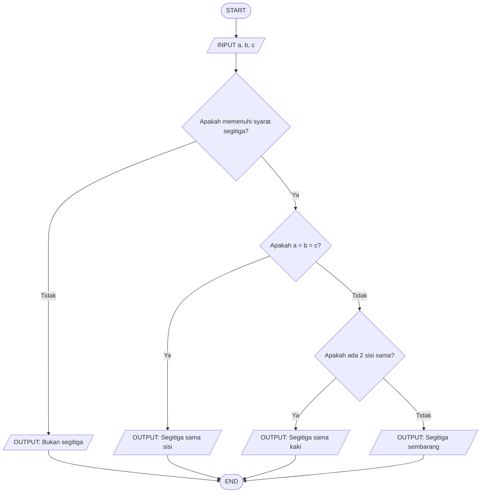

# Tugas-Algoritma-dan-Pemrograman-3F
.

🧮 Menentukan Jenis Segitiga Berdasarkan Panjang Sisi
📝 Deskripsi Masalah

Diberikan tiga buah sisi segitiga, yaitu sisi a, b, dan c. Program akan menerima panjang ketiga sisi tersebut sebagai input, kemudian menentukan apakah ketiga sisi tersebut dapat membentuk segitiga.

Jika ketiga sisi dapat membentuk segitiga, program akan menentukan jenis segitiga berdasarkan panjang sisinya, yaitu segitiga sama sisi, segitiga sama kaki, atau segitiga sembarang.

Program ini digunakan untuk menerapkan operasi perbandingan, percabangan, dan logika matematika dalam sebuah program.

📥 Input-Proses-Output

Input:
Nilai panjang sisi a, b, dan c.

Proses:

Memeriksa apakah ketiga sisi dapat membentuk segitiga dengan menggunakan syarat:
a + b > c
a + c > b
b + c > a
Jika tidak memenuhi syarat tersebut, maka ketiga sisi tidak membentuk segitiga.
Jika memenuhi syarat:
Jika a = b = c, maka segitiga merupakan segitiga sama sisi.
Jika terdapat dua sisi yang sama panjang, maka merupakan segitiga sama kaki.
Jika ketiga sisi berbeda, maka merupakan segitiga sembarang.

Output:
Jenis segitiga berdasarkan panjang ketiga sisinya.





## 🧪 Test Case

| Test Case | Input `(a, b, c)` | Hasil yang Diharapkan |
|-----------|-------------------|------------------------|
| 1 | `(5, 5, 5)` | Segitiga sama sisi |
| 2 | `(5, 5, 3)` | Segitiga sama kaki |
| 3 | `(4, 5, 6)` | Segitiga sembarang |
| 4 | `(1, 2, 5)` | Bukan segitiga |


## 📸 Hasil Pengujian

### Test Case 1

**Input:**
```text
Masukkan sisi a:
Masukkan sisi b:
Masukkan sisi c:
```

**Output:**
```text
[
]
```

---

### Test Case 2

**Input:**
```text
Masukkan sisi a:
Masukkan sisi b:
Masukkan sisi c:
```

**Output:**
```text
[Masukkan screenshot hasil pengujian Test Case 2 di sini]
```

---

### Test Case 3

**Input:**
```text
Masukkan sisi a:
Masukkan sisi b:
Masukkan sisi c:
```

**Output:**
```text
[Masukkan screenshot hasil pengujian Test Case 3 di sin]
```

---

### Test Case 4

**Input:**
```text
Masukkan sisi a:
Masukkan sisi b:
Masukkan sisi c:
```

**Output:**
```text
[Masukkan screenshot hasil pengujian Test Case 4 di sini]
```
